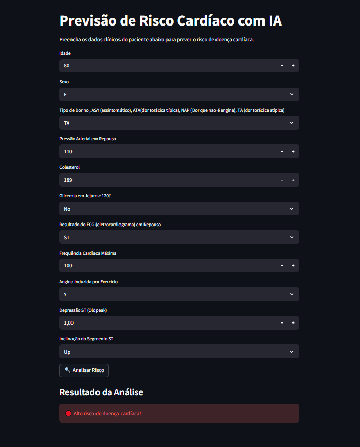
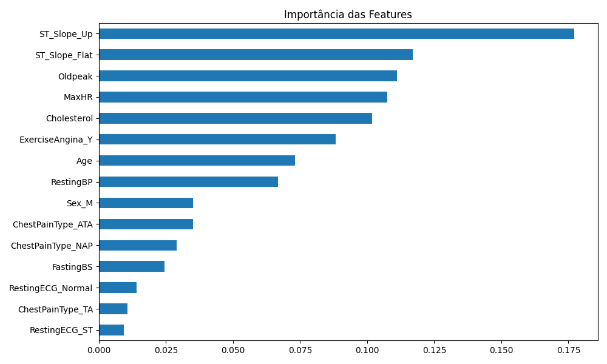

# 🫀 Predict Health Risk IA

> Ferramenta de triagem de risco cardíaco com Machine Learning — do dado clínico à predição em tempo real.



---

## 🎯 Business Goal

Doenças cardiovasculares são a principal causa de morte no mundo. O diagnóstico precoce depende de profissionais especializados e exames que nem sempre são acessíveis. Este projeto cria uma ferramenta de triagem inteligente que auxilia na identificação de pacientes em alto risco cardíaco com base em dados clínicos simples — democratizando um primeiro nível de avaliação preventiva.

> ⚠️ **Aviso:** Esta ferramenta é um apoio à triagem, não substitui diagnóstico médico profissional.

---

## ⚙️ Solution & Impact

Modelo de classificação binária (**Alto Risco / Baixo Risco**) treinado com dados clínicos reais, validado com cross-validation de 5 folds e otimizado via `RandomizedSearchCV` com foco em **recall** — minimizando falsos negativos, que representam o erro de maior impacto clínico na saúde.

Entregue como aplicação web via **Streamlit**, permitindo que qualquer pessoa insira dados clínicos e receba uma predição instantânea, sem necessidade de infraestrutura técnica.

---

## 📊 Resultados do Modelo

| Métrica | Valor |
|---|---|
| Acurácia | 88.6% |
| Recall — Alto Risco (classe 1) | **91%** |
| Precision — Alto Risco (classe 1) | 89% |
| F1-Score — Alto Risco (classe 1) | 90% |
| Média de Recall (Cross-Validation) | ~82% |

**Confusion Matrix:**
```
[[70  12]   → 70 saudáveis corretos | 12 falsos positivos
 [ 9  93]]  → 9 falsos negativos    | 93 doentes corretos
```

O modelo identifica corretamente **91% dos pacientes com risco cardíaco real** — o falso negativo (doente classificado como saudável) é o erro mais perigoso na saúde e foi o critério principal de otimização.

**Important variables**



---

## 🧠 Como funciona

1. Usuário insere dados clínicos do paciente na interface
2. Os dados passam por um pipeline de preprocessamento (normalização + encoding)
3. O modelo `RandomForestClassifier` otimizado realiza a predição
4. A interface retorna **Alto Risco** ou **Baixo Risco** em tempo real

---

## 🛠️ Tecnologias

`Python` · `Scikit-learn` · `RandomForestClassifier` · `Pandas` · `NumPy` · `Streamlit` · `Joblib` · `Matplotlib`

---

## 📁 Estrutura do Projeto

```
├── model.ipynb              # Notebook de treinamento e avaliação
├── launcher.py              # Inicializador da aplicação
├── modelo_cardiaco.pkl      # Modelo treinado serializado
├── requirements.txt         # Dependências
└── src/
    └── DataSet/
        └── heart.csv        # Dataset
```

---

## 📦 Dataset

Dataset público do Kaggle com 918 registros de pacientes e 11 variáveis clínicas:

`Age` · `Sex` · `ChestPainType` · `RestingBP` · `Cholesterol` · `FastingBS` · `RestingECG` · `MaxHR` · `ExerciseAngina` · `Oldpeak` · `ST_Slope`

🔗 [Heart Failure Prediction Dataset — Kaggle](https://www.kaggle.com/datasets/fedesoriano/heart-failure-prediction)

---

## ▶️ Como executar

```bash
# 1. Clone o repositório
git clone https://github.com/treino258/Predict-Health-Risk-IA.git
cd Predict-Health-Risk-IA

# 2. Instale as dependências
pip install -r requirements.txt

# 3. Execute a aplicação
python launcher.py
```

---

## 👨‍💻 Autor

**Vitor Albuquerque** — Machine Learning & AI
