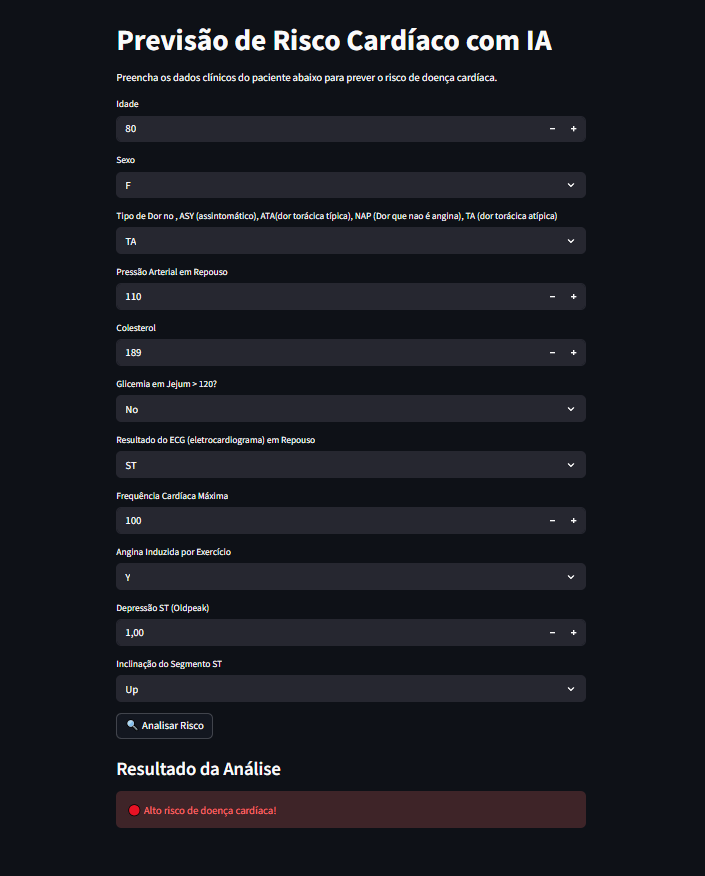

  
 
 
  


# 🫀 Predict Health Risk IA

> Ferramenta de triagem de risco cardíaco com Machine Learning — do dado clínico à predição em tempo real.



---

## 🎯 Business Goal

Doenças cardiovasculares são a principal causa de morte no mundo. O diagnóstico precoce depende de profissionais especializados e exames que nem sempre são acessíveis. Este projeto cria uma ferramenta de triagem inteligente que auxilia na identificação de pacientes em alto risco cardíaco com base em dados clínicos simples — democratizando um primeiro nível de avaliação preventiva.

> ⚠️ **Aviso:** Esta ferramenta é um apoio à triagem, não substitui diagnóstico médico profissional.

---

## ⚙️ Solution & Impact

Modelo de classificação binária (**Alto Risco / Baixo Risco**) treinado com dados clínicos reais, validado com cross-validation de 5 folds e otimizado via `RandomizedSearchCV` com foco em **recall** — minimizando falsos negativos, que representam o erro de maior impacto clínico na saúde.

Entregue como aplicação web via **Streamlit**, permitindo que qualquer pessoa insira dados clínicos e receba uma predição instantânea, sem necessidade de infraestrutura técnica.

---

## 🔍 Análise Exploratória dos Dados (EDA)

Antes de modelar, os dados foram investigados em profundidade para garantir qualidade e extrair insights clínicos.

**Qualidade dos dados**
172 pacientes apresentavam Colesterol = 0 — biologicamente impossível. Esses valores foram tratados como ausentes e substituídos pela mediana do grupo (doente/saudável), preservando o padrão clínico de cada classe.

**Principais descobertas**

| Variável | Saudável (mediana) | Doença (mediana) | Diferença |
|---|---|---|---|
| Idade | 51 anos | 57 anos | +11.8% |
| MaxHR | 150 bpm | 126 bpm | **-16.0%** |
| Colesterol | 231 mg/dL | 246 mg/dL | +6.3% |
| Oldpeak | 0.0 | 1.2 | **↑ forte** |
| RestingBP | 130 mmHg | 132 mmHg | +1.5% |

**Insights clínicos extraídos:**

- **Oldpeak** é o indicador mais discriminante — pacientes doentes têm depressão do segmento ST significativamente maior, consistente com a literatura cardiológica
- **MaxHR** inversamente associado à doença — frequência cardíaca máxima mais baixa indica menor capacidade funcional cardíaca
- **FastingBS** (glicemia em jejum > 120) aparece quase exclusivamente em pacientes doentes, sugerindo forte associação com risco metabólico-cardiovascular
- **Colesterol** apresenta alta variabilidade e outliers expressivos — variável ruidosa que exigiu tratamento cuidadoso
- **Idade** média dos doentes é 6 anos superior, reforçando o risco crescente com o envelhecimento

---

## 📊 Resultados do Modelo

| Métrica | Valor |
|---|---|
| Acurácia | 88.6% |
| Recall — Alto Risco (classe 1) | **91%** |
| Precision — Alto Risco (classe 1) | 89% |
| F1-Score — Alto Risco (classe 1) | 90% |
| Média de Recall (Cross-Validation) | ~82% |

---

**Confusion Matrix:**
```
[[70  12]   → 70 saudáveis corretos | 12 falsos positivos
 [ 9  93]]  → 9 falsos negativos    | 93 doentes corretos
```

O modelo identifica corretamente **91% dos pacientes com risco cardíaco real** — o falso negativo (doente classificado como saudável) é o erro mais perigoso na saúde e foi o critério principal de otimização.

---

## 🧠 Decisões Técnicas
**Por que Recall como métrica principal?**
Em triagem cardíaca, os dois tipos de erro têm custos assimétricos:

Falso Negativo (alto risco classificado como baixo): paciente não recebe atenção médica → consequência potencialmente fatal
Falso Positivo (baixo risco classificado como alto): paciente faz exames desnecessários → custo controlável

Por isso, minimizar Falsos Negativos é prioridade. O Recall mede exatamente isso: dos pacientes que realmente têm alto risco, quantos o modelo identifica corretamente?

Acurácia seria uma métrica enganosa aqui — com dataset desbalanceado, um modelo que classifica tudo como "baixo risco" pode ter acurácia alta e Recall zero.

Resultado obtido: 91% de Recall e 90% de F1-Score na classe de alto risco.

**Por que RandomForestClassifier?**
Três razões práticas para esse problema:

Interpretabilidade: fornece feature_importances_, permitindo entender quais variáveis clínicas mais influenciam o risco — essencial em contexto médico
Robustez a outliers: dados clínicos têm ruído natural (ex: 172 registros de colesterol inconsistentes tratados via imputação por mediana)
Desempenho sem escalonamento: diferente de SVM ou KNN, não exige normalização das features, simplificando o pipeline de inferência


**Por que imputação por mediana no colesterol?**
172 registros apresentavam colesterol = 0, valor clinicamente impossível.
Duas opções foram consideradas:

Remover os registros: perderia ~18% do dataset — impacto significativo para um modelo de saúde
Imputar pela mediana: preserva os dados e é robusto a outliers, ao contrário da média

A mediana foi escolhida por ser menos sensível aos valores extremos presentes na distribuição de colesterol.

**Por que validação cruzada (5-fold) além do train_test_split?**
O train_test_split avalia o modelo em uma única divisão — resultado dependente do acaso da partição.
A validação cruzada com 5 folds garante que todo dado foi usado tanto para treino quanto para teste, produzindo uma estimativa mais confiável da capacidade de generalização do modelo.

---

## 🧠 Como funciona

1. Usuário insere dados clínicos do paciente na interface
2. Os dados passam por um pipeline de preprocessamento (normalização + encoding)
3. O modelo `RandomForestClassifier` otimizado realiza a predição
4. A interface retorna **Alto Risco** ou **Baixo Risco** em tempo real

---

## 🛠️ Tecnologias

`Python` · `Scikit-learn` · `RandomForestClassifier` · `Pandas` · `NumPy` · `Streamlit` · `Joblib` · `Matplotlib`

---

## 📁 Estrutura do Projeto
```
├── model.ipynb              # Notebook de treinamento e avaliação
├── launcher.py              # Inicializador da aplicação
├── requirements.txt         # Dependências
└── src/
    ├── app/
    │    └── app.py
    ├── models/
    │    └── modelo_cardiaco.pkl  # Modelo treinado serializado
    ├── DataSet/
    │    └── heart.csv        # Dataset
    └── img/
        
```

---

## 📦 Dataset

Dataset público do Kaggle com 918 registros de pacientes e 11 variáveis clínicas:

`Age` · `Sex` · `ChestPainType` · `RestingBP` · `Cholesterol` · `FastingBS` · `RestingECG` · `MaxHR` · `ExerciseAngina` · `Oldpeak` · `ST_Slope`

🔗 [Heart Failure Prediction Dataset — Kaggle](https://www.kaggle.com/datasets/fedesoriano/heart-failure-prediction)

---

## ▶️ Como executar

```bash
# 1. Clone o repositório
git clone https://github.com/treino258/Predict-Health-Risk-IA.git
cd Predict-Health-Risk-IA

# 2. Instale as dependências
pip install -r requirements.txt

# 3. Execute a aplicação
python launcher.py
```

---

## 👨‍💻 Autor

**Vitor Albuquerque** — Machine Learning & AI
